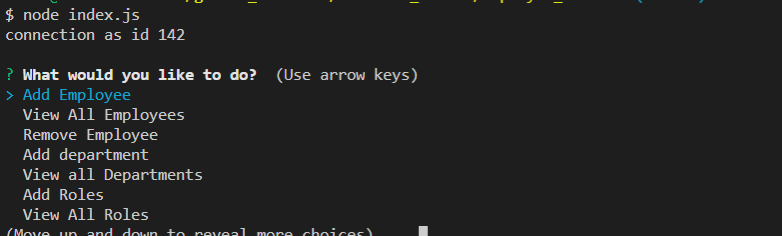

# employee_tracker


# Team Template Engine

## Description

Developers are often tasked with creating interfaces that make it easy for non-developers to view and interact with information stored in databases. Often these interfaces are known as Content Management Systems. this app is to architect and build a solution for managing a company's employees using node, inquirer, and MySQL.

## Table of Contents

- [License](#license)
- [Installation](#installation)
- [Tests](#tests)
- [Usage](#usage)
- [Contributing](#contribution)
- [Questions](#questions)

## Installation

```
 * Git terminal
 * Node
 * MySQL and MySQL Workbench (or the terminal instead of MySQL Workbench)
```

## Tests

`node index.js`

## Usage

As a business owner
I want to be able to view and manage the departments, roles, and employees in my company
So that I can organize and plan my business

## License

ISC

## Contributing

Sole contributor by Jeff Miao

## Questions

GitHub: https://github.com/miao0007

Email: miao188@hotmail.com

## Deployed Video Link

https://drive.google.com/file/d/1aj5GXVN9Q82Cjl7j-szodr5UfaCE0ysg/view?usp=sharing

## Test Preview




